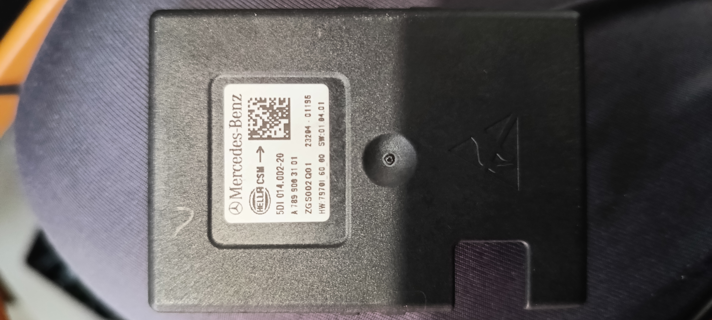

# Mercedes EQS BMS research

Doing my own research from scratch.
Since there was no information available from third party sources
at the moment of creation of this repository.

I'll add more details as I go along.

## Discovered internals

### Current sensor

_(Part number)_


_(Internals: Front)_


_(Internals: Rear)_

- Current sensor, based on good ol' shunt
- CAN + LIN interface (Longest chip: NXP: UJA1075A)
- Unknown OEM chip 10104 TJ10173 2247 4NC (middle one). Looks like some NXP based MCU for can controlling
- NXP: MC33772BTC0

Connector socket pinout 0...5 (facing from outside, **LEFT** to **RIGHT** order →):

- 1 - GND
- 2 - CANH
- 3 - CANL
- 4 - VCC (12V input) -> V2 (CAN 5v voltage regulator)
- 5 - (5V output) Unknown purpose pin traced to unknown OEM chip 48 pin (last).
- 6 - ??? Goes through capacitor to the ground (not connected to the bms via cable and just floating)

Initial assumption was: 2CAN, 1LIN, 12V, gnd.
But with V2 regulator linked directly to socket pin.
LIN might not be used after all. - Weird solution...

I also assume it should just broadcast generic CAN messages with current and other status values.

5th pin goes from leg to unmarked black smd component in parallel (grounded), probably inductor, but strangely have 1.5kOhm resisistance. I guess ferrite bead? It also goes to the 1100ohm resistor which terminates protective SOD-23 diode. Later it goes via some small inductor, then to the capacitor (parallel with ground) and to the MCU 48pin

Quartz at 21/22 pin on unknown OEM mcu. 

> 11.09.2026

We powered BMS and got can messages on 1000kbps rate:
Looks like: 0x080, 0x420, 0x430 are not related to current sensor.
(exclude 1db, since it's what we send via our can analyzer...)

We've just quickly short circuited 3.7v 18650 battery to test shunt capabilities with about 3A current.
0x10, 0x40, 0x50, 0x60 - Are definitely current sensing values. Looks like tripple reduntancy is present.

I have made our local logs compatible with SavvyCAN software (converted to CSV)

Reverse engineering. First byte MSB bit is considered 0, LSB is considered 7.
- 0x10:
	byte 0, bit 0 len:8 - checksum (unknown)
	byte 1, bit 0 len:8 - counter
	byte 2, bit 0, len 24 - signed current adc0 0.0001x ?
	byte 5, bit 0, len 24 - signed current adc1 0.0001x ?

- 0x40:
	byte 0, bit 0 len:8 - checksum (unknown)
	byte 1, bit 0 len:8 - counter

- 0x50:
	byte 0, bit 0 len:8 - checksum (unknown)
	byte 1, bit 0 len:8 - counter

- 0x60:
	- bits 0-24 (len:25) - signed current? (fluctuates between neg/pos values)

So after a bit of research i have found that 0x10 is most likely main current sensing message,
Other are not meaningful or unknown

> 14.09.2026

I've added hap_c89_template into src/ and started writing abstract code to reflect current sensor functionality.

> 16.09.2026

I've added abstract code for the current sensor and test cases to the project.

## Coding guidelines
> Insert this section as a placeholder at the end of README
> This section is a part of https://furdog.github.io/hap_c89_template/

- Linux kernel style, `snake_case`
- Before commit run: `make format lint fix misra test coverage docs` (or just `make`)
- Follow [The Power of 10: Rules for Developing Safety-Critical Code](https://spinroot.com/gerard/pdf/P10.pdf). Local edit available under [P10.md](./docs/P10.md)
- Doxygen style docs
- Enable github pages (set Actions as source)
	Once enabled, pages will be available under:
	- Doxygen: `%https://<your-username>.github.io/<your-repo>/`
	- Coverage: `%https://<your-username>.github.io/<your-repo>/coverage/`

### Recomended naming
Scientific units with short qualifier prefixes where possible.

Pattern: `[property_description]_[qualifier][scale][unit]_[offset]_[type]`
All sufixes after `property_description` are optional.
```C
timer_r10ms_u8        (Resolution: 10ms/bit, Type: uint8_t)
power_r150w           (Resolution: 150W/bit or 0.15kW/bit)
soc_r0p1pct_u16       (Resolution: 0.1%/bit, Type: uint16_t)
carbon_q5mol_u32      (Quantity:   5mol/unit, Type: uint32_t)
speed_r0p5kmh_offn500 (Resolution: 0.5km/h, Offset: -500)
prescaler_r1div7      (Resolution: 1/7 or 0,142857...)
```
Always document qualifiers.
Provide list of units used, as well as qualifiers or special case notation.

### Placeholders
Source file placeholder example:
````C
/**
 * @file template.h
 * @brief Template (Hardware-Agnostic)
 *
 * This file contains the software implementation of the #TEMPLATE logic.
 * The design is hardware-agnostic, requiring an external adaptation layer
 * for hardware interaction.
 *
 * ```LICENSE
 * Copyright (c) 2026 furdog <https://github.com/furdog>
 *
 * SPDX-License-Identifier: 0BSD
 * ```
 */
````

Copyright notice:
```LICENSE
Copyright (c) 2026 furdog <https://github.com/furdog>

SPDX-License-Identifier: 0BSD
```

**Be free, be wise and take care of yourself!
With best wishes and respect, furdog!**
